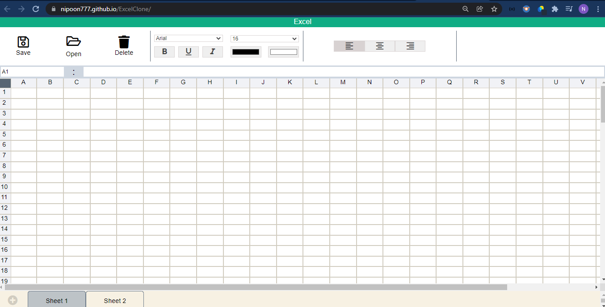
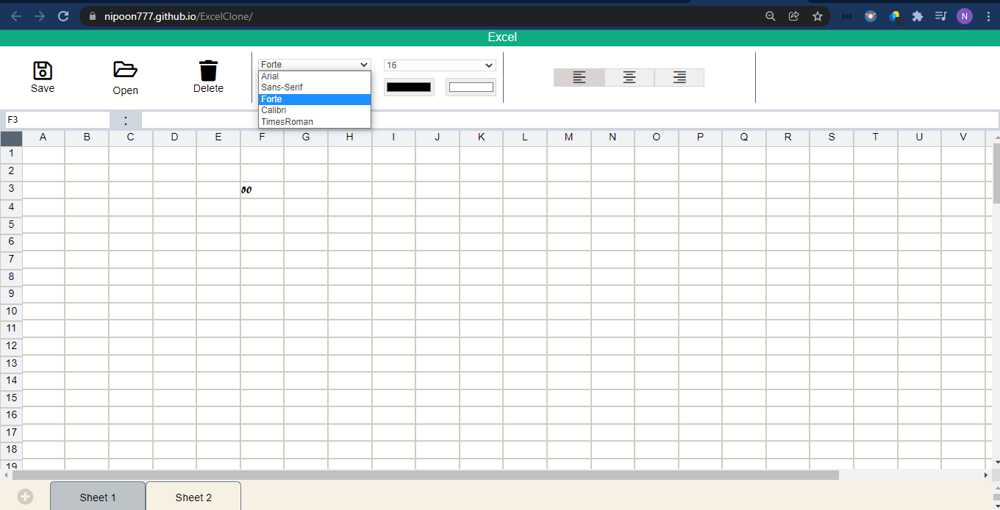
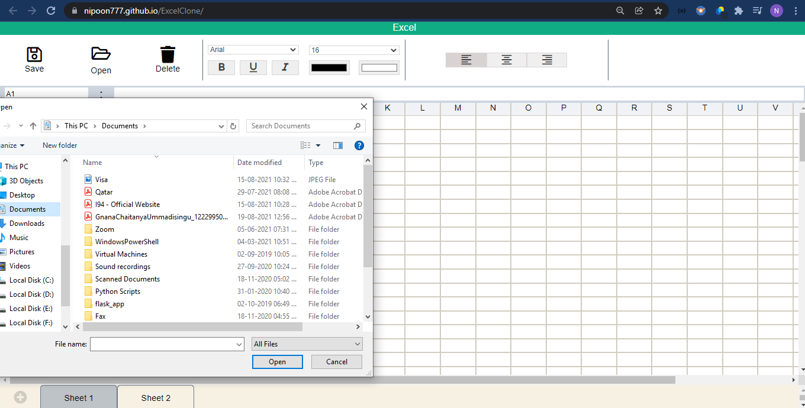

# ExcelClone

# Live Site Link:
https://nipoon777.github.io/ExcelClone/

# Description:
The Web Application has most of the Features of a Normal Spreadsheet Application. The main speciality of the Application is it does not use any backend storage.
Implementation of Website is done in a way to understand how Data Structures are used in real application, how data manipulation can be done. The application is built by using vanilla JavaScript, HTML, CSS.

# Features:

- Apply Formulas to Cell
- Have Multiple Sheets
- Open an Existing Sheet
- Delete Sheets
- Save your spread sheet
- Apply Formatting and Styling to cell Data

# Learning:
Applied the Graphical Cycle detecting alogorithm to figure out if there is a cycle formation when applying formulas.

